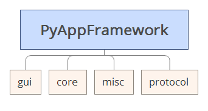

PyAppFramework
========

Python Application Framework (Python 2.7)

## Description

A concise easy to use PySide GUI Application Framework, make you build yourself application easier

## Request

- Python 2.7 
- PySide
- pyserial

## Feature
- Cross-platform: Windows、Linux、Mac OS X
- Provide multi ui elements manage tools, get/set form data easier and smart
- Provide several self define Qt widget, make create cross platform application more easier and fast
- Provide several internet and serial basic protocol, you can base this build more complex up level protocol

## Modules

- gui: PySide base self define GUI elements
- core: basic data structure and data type convert helper functions
- misc: miscellaneous functions
- protocol: basic internet and serial protocol

